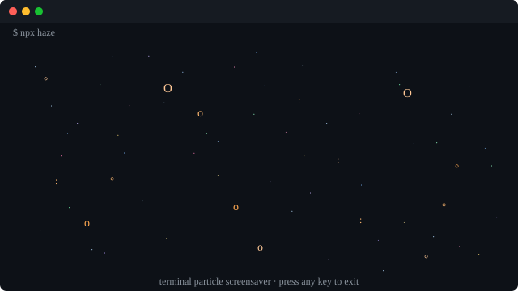

<p align="center">
  <h1>haze</h1>
  <p>Terminal particle system. Stars drift. Colours shift. You watch.</p>
  <a href="https://www.npmjs.com/package/@neocrev/haze"></a>
  <a href="LICENSE"></a>
</p>

<p align="center">
  
</p>

```bash
npx @neocrev/haze
```

Press any key to exit.

---

## How it works

Two particle types drift across your terminal:

| Type | Characters | Behaviour |
|------|------------|-----------|
| Stars | `·` `˙` `⋆` `✧` `+` | Numerous, twinkle |
| Embers | `.` `:` `°` `o` `O` | Larger, slower |

Six colour palettes cycle through: ice blue, warm orange, lavender, pink, mint, gold.

Compatible with macOS, Linux, WSL. Zero dependencies.

---

## License

MIT
